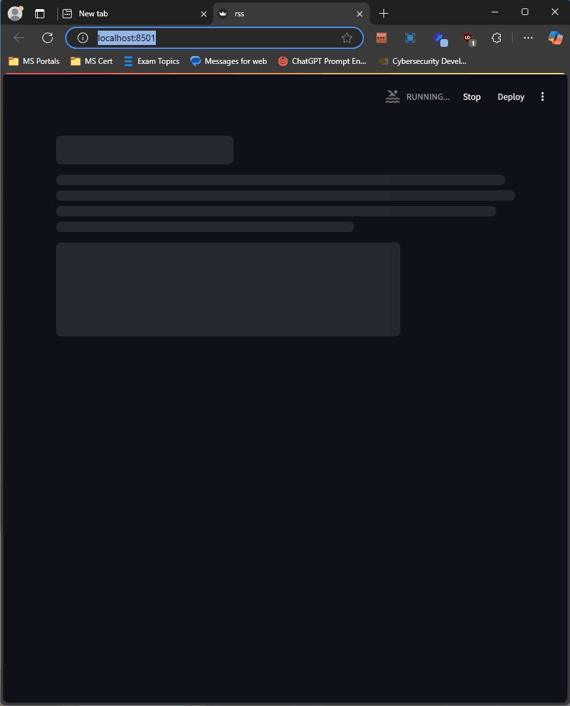

# Cybersecurity News #
### Demo

### Description ###

The Cybersecurity News Dashboard is a Python application designed to fetch, filter, and display the latest cybersecurity news articles from multiple RSS feeds. It automates the retrieval and analysis of news entries, presenting relevant articles based on a set of predefined cybersecurity keywords. The application is built with Streamlit to create an interactive, user-friendly dashboard for easy consumption of cybersecurity-related content.

### Features ###

1. RSS Feed Aggregation:
   - Fetches news articles from multiple cybersecurity-focused RSS feeds.
   - Filters articles to display only those containing relevant keywords like "ransomware," "zero-day," "cyberattack," and more.
   - Keyword Matching:
   - Employs regular expressions to scan article titles and summaries for keywords, ensuring the most relevant content is shown.
   - 
2. Article Recency:
   - Includes only articles published within the last 30 days to ensure up-to-date information.
     
3. JSON Storage:
   - Saves filtered articles to a cybersecnews.json file, which serves as the data source for the dashboard.

4. Interactive Dashboard:
   - Built with Streamlit, the dashboard displays articles with titles, summaries, publication dates, and links to full content.
   - Supports a "Stop Dashboard" button to safely terminate the application.
   - Users can browse articles in a grid layout, view summaries, and click "Read More" links to access the full article.

5. Performance Optimizations:
   - Implements a timeout for fetching each RSS feed, avoiding delays caused by unresponsive servers.
   - Checks if the cybersecnews.json file is outdated (modified on the previous day) and only fetches new articles if necessary.

6. Fetching and Filtering:
   - The application scrapes RSS feeds from well-known cybersecurity sources.
   - Filters out irrelevant content using keyword matching and recency checks.
     
7. Data Persistence:
   - The processed articles are saved to a JSON file to minimize unnecessary network requests.
   - If the JSON file already exists and is up-to-date, the dashboard directly loads the data without re-fetching.

8. Shutdown Mechanism:
   - A dedicated "Stop Dashboard" button terminates the application, including the Streamlit server, for easy cleanup.

### Installation and Setup ###

9. Prerequisites:
   - Python 3.8 or higher
   - Libraries: requests, feedparser, bs4 (BeautifulSoup), pandas, streamlit, dateutil

10. Streamlit
    - pip install streamlit
    - streamlit run rss.py

11. Stopping the Application:
    - Click the "Stop Dashboard" button to terminate the server.

12. Current feeds:
    - Krebs on Security
    - Malware Traffic Analysis
    - US-CERT Alerts
    - Cybersecurity News
    - Bleeping Computer
    - SecurityWeek
    - Dark Reading
    - ZDNet Security
    - The Hacker News

13. License
    - This project is open-source and available under the MIT License.

